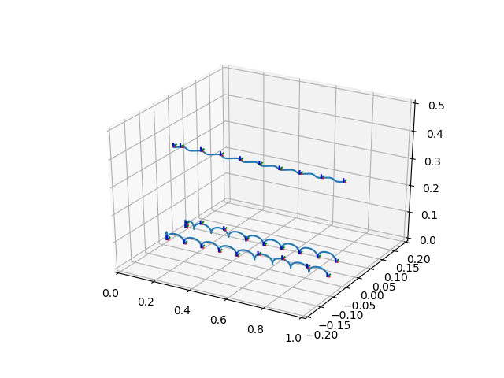
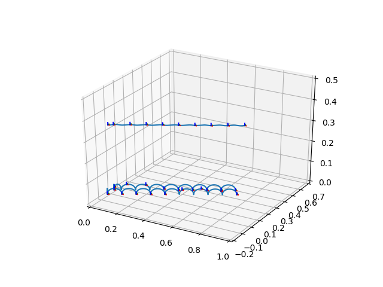
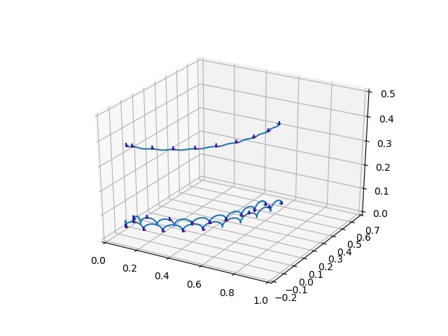

# Omnidirectional Walking Pattern Generation for Humanoid Robot using ZMP Analytical Method

By: Eko Rudiawan

**Overview**

This is an implementation of omnidirectional walking pattern generator for humanoid robot using ZMP analytical approach that was proposed by Harada, Kensuke, et al. The input is defined as motion command $cmd_x$, $cmd_y$, and $cmd_\theta$ that represented next landing position and orientation of swing foot. The source code will generate trajectory of CoM, left foot and right foot written from world coordinate. This code can be implemented on real robot by adding inverse kinematics solver.

**Example Results**

1. Forward walking with motion command $cmd_x = 0.05$, $cmd_y = 0.00$, and $cmd_\theta = 0.00$

    

2. Diagonal walking with motion command $cmd_x = 0.04$, $cmd_y = 0.02$, and $cmd_a = 0.00$

    

3. Turning with motion command $cmd_x = 0.05$, $cmd_y = 0.00$, and $cmd_a = 10^o$

    

**References**

[1] [Harada, Kensuke, et al. "An analytical method for real-time gait planning for humanoid robots." International Journal of Humanoid Robotics 3.01 (2006): 1-19.](https://www.worldscientific.com/doi/abs/10.1142/S0219843606000643)